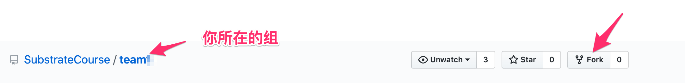
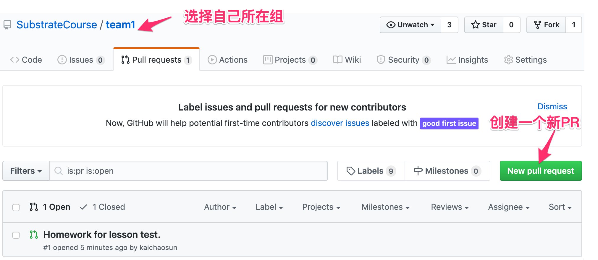
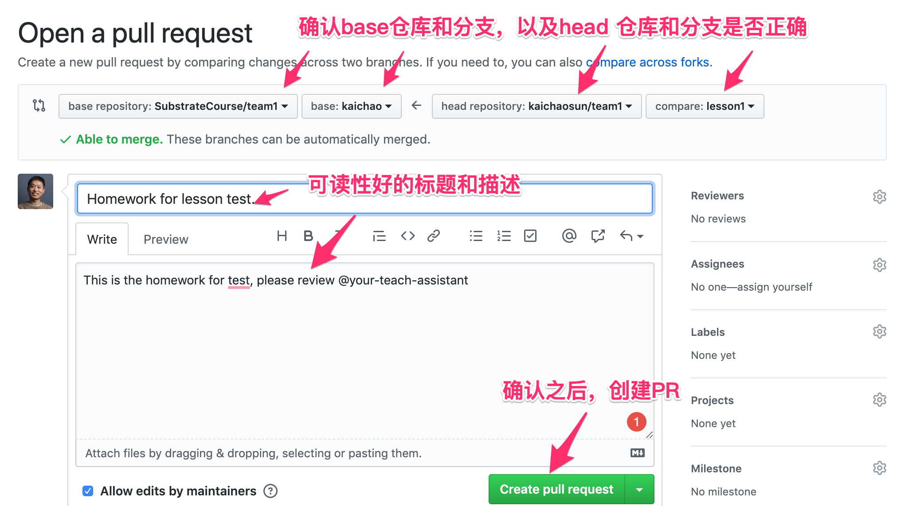
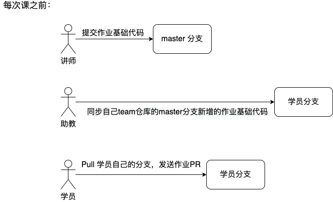

# 作业

## 学员提交作业流程

### 准备

1. 首先Fork自己所在组的代码仓库（本仓库）到自己的Github用户里，



2. 接着在本地，克隆刚刚Fork过来的代码仓库，Git命令为:

```
git clone git@github.com:<your-github-account>/<your-team>.git
```

替换`your-github-account`为自己Github账户名，`<your-team>`为自己所在组。

3. 然后在本地，添加自己所在组的代码仓库链接，方便后面更新代码，Git命令为：

```
git remote add upstream git@github.com:SubstrateCourse/<your-team>.git
```

替换`<your-team>`为自己所在组。通过`git remote -v`，你应该能看到新添加的远端仓库链接。


### 写作业流程

注意：**每次写作业**都需要按照下面的流程进行。

1. 首先在本地，切换到以自己名字命名的分支， Git命令为：

```
git checkout <your-name>
```

替换`your-name`为自己的名字，如果没有，联系助教进行添加。

2. 之后在本地，更新远端的代码到本地，Git命令为：

```
git pull upstream <your-name>
```

替换`your-name`为自己的名字，注意这里**不能**是master分支。

3. 接着在本地，创建一个新的分支，Git命令为：

```
git checkout -b <lesson-n>
```

替换`lesson-n`为第几节课，比如第一节课的作业是`lesson-1`。

4. 进入到对应的作业目录里，开始写作业...

5. 作业在本地完成后，commit 需要提交的作业内容，Git命令为：

```shell
// 添加你需要提交的作业
git add -p

// commit 修改到本地
git commit -m "homework for lesson n"
```

注意，你也可以包含多个commit记录，防止写作业的时候代码丢失，评分只会按照最终的代码结果。`git add <file-name>`可以添加某个文件。

6. push到自己的Github仓库里，Git命令为：

```
git push origin <lesson-n>
```

这里的`lesson-n`和上面的一致。

7. 发送作业PR，





8. 通知助教批改作业。

## 讲师、助教职责

本仓库的master分支由讲师提交；

本仓库由学员名字命名的分支，由学员通过发送PR提交，助教review之后merge到相应的分支。

每节课之前，master分支会提交该课的作业基础代码，由助教将新增的代码同步到学员分支。

*Flow:*



